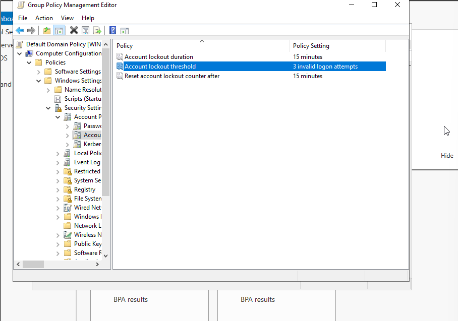
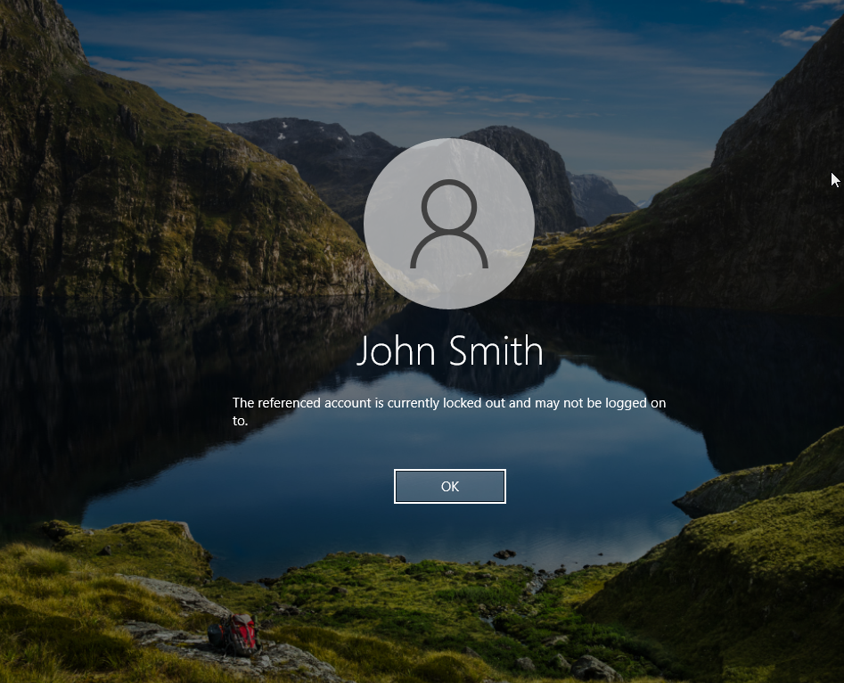

# Active Directory Account Lockout & Unlock Lab

## Objective
Demonstrate how to identify, troubleshoot, and unlock a locked Active Directory user account.

## Tools Used
- Windows Server 2022
- Active Directory Users and Computers
- Group Policy Management
- Windows 10 Client VM

## Steps Performed
1. Configured an Account Lockout Policy.
2. Triggered an account lockout through failed login attempts.
3. Verified the account was locked.
4. Reviewed the lockout status in Active Directory.
5. Confirmed the lockout process was working as expected.

## Screenshots

