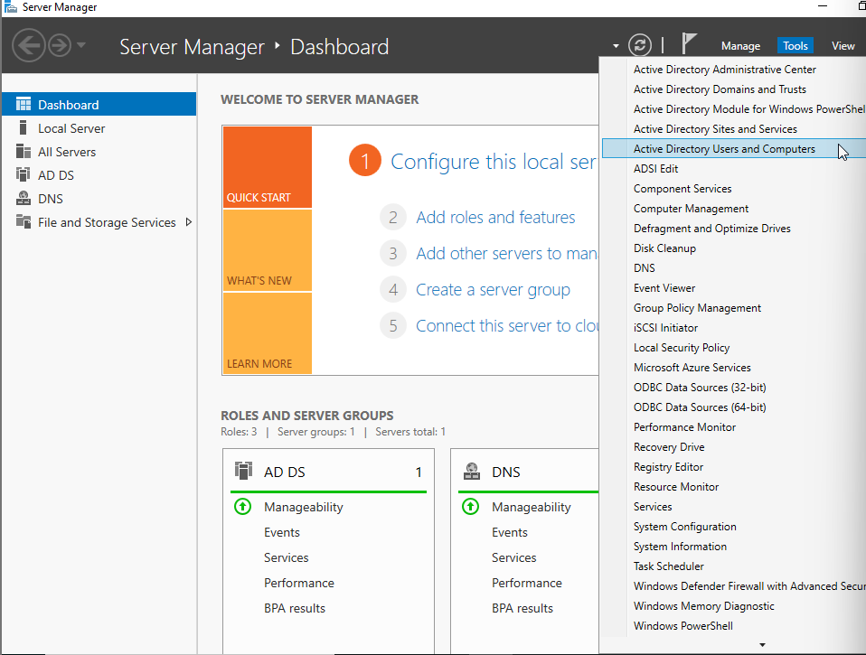
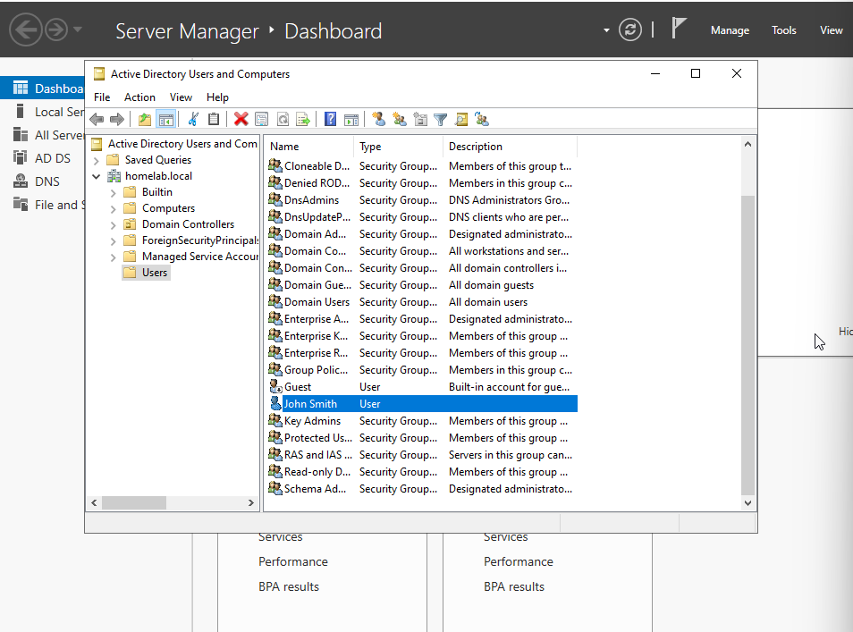
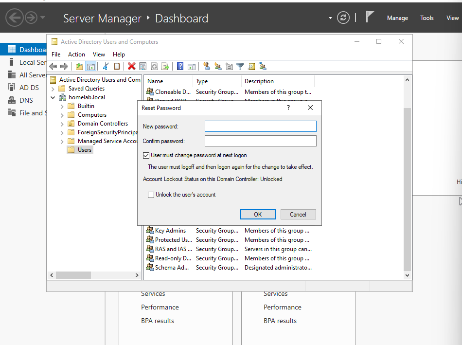

# Password Reset Lab

## Objective
Practice resetting a user password in Active Directory.

## Environment
- Windows Server 2022
- Active Directory
- Windows 10 Client

## Steps Performed
1. Opened Active Directory Users and Computers.
2. Located the test user account.
3. Selected Reset Password.
4. Assigned a new password.
5. Required password change at next login.

## Result
Successfully reset the password and verified the user could authenticate.

## Skills Demonstrated
- Active Directory
- Password Resets
- User Account Management
- Troubleshooting

## Screenshots

### Opening Active Directory Users and Computers

### User Account Located

### Password Reset Process

